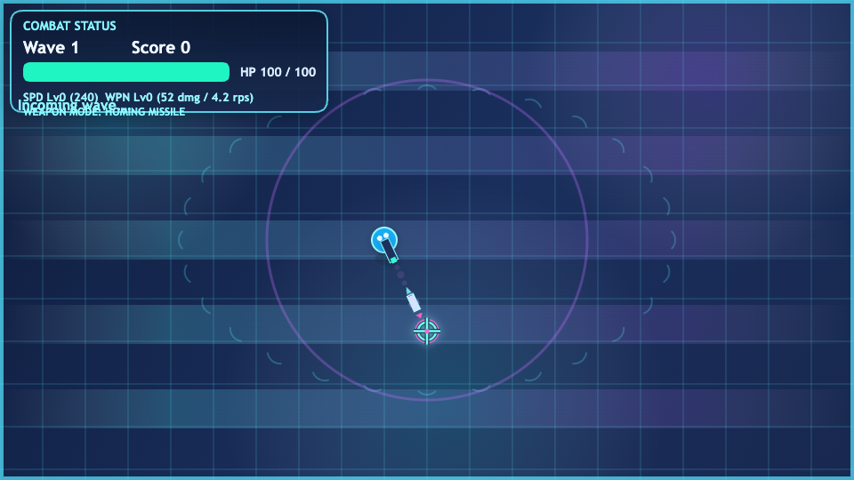

# Arena Solo Shooter

HTML, CSS, JavaScript만으로 만든 1인용 브라우저 슈팅 게임입니다.

플레이 링크:

https://yongdeok43.github.io/ianFight/

## 스크린샷



## 소개

Arena Solo Shooter는 탑다운 시점으로 진행되는 웨이브 생존형 슈팅 게임입니다. 적의 공격을 피하면서 유도 미사일을 발사하고, 드롭 아이템으로 능력을 강화하며 가능한 오래 버티는 것이 목표입니다.

## 조작법

- 이동: `WASD` 또는 방향키
- 조준: 마우스
- 공격: 마우스 왼쪽 클릭 또는 `Space`
- 전체화면: `F`

## 특징

- 웨이브 기반 생존 전투
- 보스 웨이브를 포함한 다양한 적 타입
- 폭발 피해가 있는 미사일 공격
- 드롭 아이템 기반의 런 업그레이드
- 빌드 과정 없이 바로 실행 가능한 정적 파일 구조

## 로컬 실행

이 프로젝트는 정적 사이트라서 간단한 파일 서버만 있으면 바로 실행할 수 있습니다.

```bash
python3 -m http.server 8000
```

실행 후 `http://localhost:8000` 에 접속하면 됩니다.

## 파일 구성

- [index.html](/Users/double.d/Documents/workspace/ianFight/index.html): 게임 캔버스와 기본 페이지 구조
- [style.css](/Users/double.d/Documents/workspace/ianFight/style.css): UI와 레이아웃 스타일
- [game.js](/Users/double.d/Documents/workspace/ianFight/game.js): 게임 핵심 로직

## 배포

이 저장소는 [deploy-pages.yml](/Users/double.d/Documents/workspace/ianFight/.github/workflows/deploy-pages.yml)을 통해 GitHub Pages로 자동 배포되도록 설정되어 있습니다.
